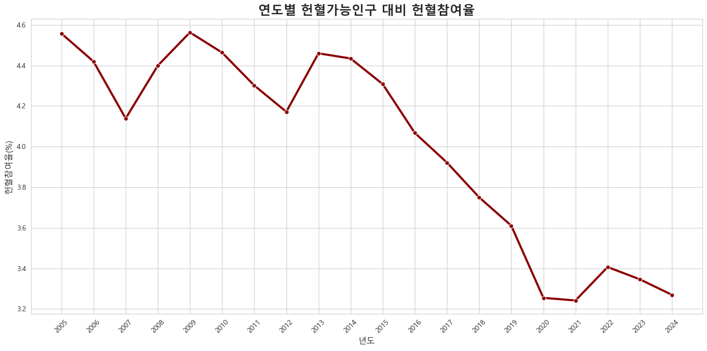
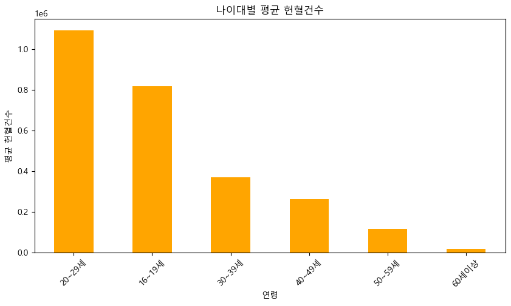
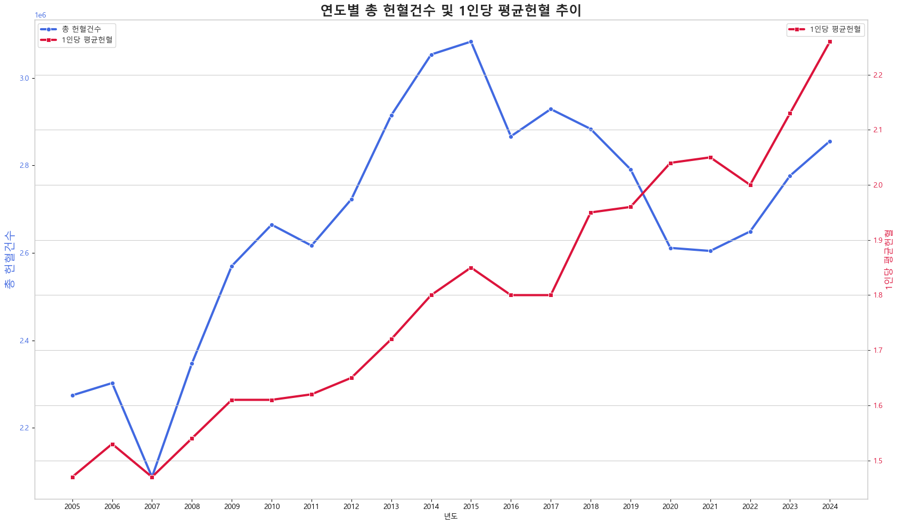

# 🩸 국내 헌혈 수급 현황 분석 및 시계열 기반 헌혈 건수 예측 모델링 프로젝트
> **KOSIS 공공데이터와 머신러닝 기법을 활용한 대한민국 헌혈 실적 및 예측 모델링**

본 프로젝트는 공공데이터포털(KOSIS OpenAPI 및 통계 자료)을 활용하여 지난 20개년(2005년~2024년) 동안의 대한민국 헌혈 데이터(연도별·월별·연령별·직업별·지역별·혈액형별·혈액보유량 등)를 종합적으로 수집·정제하고, 탐색적 데이터 분석(EDA)을 통해 핵심 인사이트를 도출한 뒤, 시계열적 특성을 반영한 선형회귀 및 규제 모델(Ridge, Lasso)을 통해 미래 헌혈 건수를 예측하는 프로젝트입니다.

---

## 📂 프로젝트 핵심 문서 바로가기 (Project Documents)
> 💡 각 아이콘 또는 링크를 클릭하면 해당 문서(노션/구글 드라이브 등)로 바로 이동합니다.

| 분류 | 산출물 목록 | 바로가기 링크 |
| :--- | :--- | :--- |
| **기획 및 제안** | 📑 프로젝트 기획서 & 제안서 | [👉 기획서 1](https://app.notion.com/p/AI-34d1043acf1280938479e01a40e712cf?source=copy_link) /[👉 제안서 2](https://app.notion.com/p/35b1043acf12801d9fe2f434b4c2ea19?source=copy_link) |
| **EDA** | 🧼 데이터 전처리 보고서 | [👉 전처리보고서 보기](https://app.notion.com/p/3651043acf12801db329e69770dcb091?source=copy_link) |
| **데이터 명세서** | 🗂️ 데이터 명세서 (Data Schema) | [👉 데이터명세서 보기](https://app.notion.com/p/35c1043acf1280f9ab6fcfa6cf096538?source=copy_link) |
| **탐색적 분석** | 📊 탐색적 데이터 분석 보고서 (EDA) | [👉 EDA보고서 보기](https://app.notion.com/p/EDA_BD-3591043acf1280e28dd1cffdc03389ce?source=copy_link) |
| **PPT** | 🖨️ 프로젝트 최종 발표 PPT (PDF) | [👉 발표 PPT 보기](https://drive.google.com/file/d/1fJCJ__jedu41jm7nGg6LAQrErPXZKxGg/view?usp=drive_link) |

---

## 🌳 프로젝트 구조 시각화

├── data/                  # 원천 데이터 및 전처리 데이터
├── notebooks/             # jupyter notebook 파일들
│   ├── 01_Data_preprocessing_BD.ipynb
│   ├── 02_EDA_BD.ipynb
│   └── 03_Modeling_BD.ipynb
├── images/                # 시각화 그래프 이미지 저장
└── README.md

📅 프로젝트 기간 & 참여 인원
진행 기간: 2026년 5월

참여 인원: 개인 프로젝트

🛠️ 사용 기술 및 개발 환경 (Tech Stack)
Language: Python 3.14+

Data Engineering & EDA: Pandas, NumPy, Requests, JSON, Matplotlib, Seaborn

Machine Learning: Scikit-learn (LinearRegression, Ridge, Lasso, StandardScaler, XGBRegressor)
---

## 1. 📌 프로젝트 기획안 & 제안서
[
(https://app.notion.com/p/35b1043acf12801d9fe2f434b4c2ea19?source=copy_link)]
* **배경:** 전체 헌혈건수의 증감만읠 확인하는것을 넘어 연령,직업별로 다차원적인 통계 데이터를 종합적으로 정제하고 분석하여 혈액 수급 불균형을 완화하고 최적의 마케팅 시점을 예측하고자함 .
* **목표:** 다차원 인구학적 통계 분석을 기반으로 안정적인 혈액 보유량 유지를 위한 선제적 대응 및 다음년도 헌혈 건수 예측 모델 구축.

---

## 2. 🌐 데이터 수집 & 명세 (Data Collection & Specification)
[))
* **수집 출처:** 공공데이터포털 및 통계청 KOSIS Open API
* **수집 데이터:** 연도별·월별 기초 실적 데이터 및 세부 8개 영역(연령별, 직업별, 지역별, 혈액보유량 등)의 다차원 데이터셋 구축.
* **데이터 명세:** 각 피처(Feature)의 데이터 타입, 의미, 수집 주기 등을 표준화한 명세서 작성 완료.

---

## 3. 🧼 데이터 전처리 보고서 (Data Preprocessing)
[
* 분산되어 있던 데이터프레임들을 한글 컬럼명 표준화 및 `utf-8-sig` 인코딩 최적화 단계를 거쳐 정리했습니다.
* 8개 영역의 세부 지표를 전처리 파이프라인을 통해 `전처리2/` 폴더 내 개별 파일로 분할 저장 후, 머신러닝 학습이 가능하도록 `년도`와 `월` 기준 기존 테이블 pivot table 처리 후 통합 데이터프레임으로 `Merge` 결합 처리를 완수했습니다.

# 1. 연령별 데이터 전처리
def preprocess_age(age_df):
    age = age_df[["연령코드", "연령명", "기준연도", "헌혈건수", "단위"]].copy()
    
    # 불필요 데이터 제거 및 코드 매핑
    age = age[age["연령코드"] != "A001"]
    age_map = {"A002": 10, "A003": 20, "A004": 30, "A005": 40, "A006": 50, "A007": 60}
    age["연령코드"] = age["연령코드"].map(age_map)
    
    # 타입 변환 및 라벨링
    age = age.dropna(subset=['연령코드'])
    age["연령코드"] = age["연령코드"].astype(int)
    
    label_map = {10: "16~19세", 20: "20~29세", 30: "30~39세", 40: "40~49세", 50: "50~59세", 60: "60세이상"}
    age["연령대"] = age["연령코드"].map(label_map)
    return age

# 2. 직업 데이터 전처리
def preprocess_job(job_df):
    job = job_df.copy()
    job['건'] = job['건'].replace('-', np.nan).astype(int)
    return job

# 3. 장소 데이터 전처리 및 기관 구분
def preprocess_location(location_df):
    loc = location_df[['장소코드', '장소명', '혈액원명', '헌혈건수', '단위']].copy()
    
    # 합계 및 불필요 데이터 제거
    loc = loc[(loc['혈액원명'] != '합계') & (loc['장소명'] != '합계')]
    loc = loc[loc['혈액원명'] != '대한적십자사 외']
    
    # 기관 구분 로직
    loc['기관구분'] = '지역혈액원'
    loc.loc[loc['혈액원명'] == '대한적십자사', '기관구분'] = '중앙기관'
    return loc

3.2 데이터 통합 및 전처리 (Merge & Preprocessing)모델링을 수행하기 전, 개별 범주별로 분리된 데이터를 년도와 월을 기준으로 통합하고, 학습에 최적화된 형태로 가공하는 과정을 거칩니다.
1. 데이터 로드 및 통일 :
   다양한 소스에서 불러온 데이터의 컬럼명과 데이터 타입을 표준화하여 병합의 기준을 맞춥니다.표준화 작업:컬럼 공백 제거(strip)연도, 기준연도 → 년도로 명칭 통일연도 및 월 데이터를 int 타입으로 변환
3. Pivot Table 변환 및 특성 엔지니어링:
   범주형 데이터(연령, 직업, 지역)를 모델 학습이 가능한 피처로 만들기 위해 pivot_table을 사용하여 행(년도) 기반의 열 형태로 재구성합니다.
   피벗 수행: 각 카테고리별로 헌혈건수를 합산하여 년도 기준으로 집계접두사 추가: 변수 간 구분을 위해 각 컬럼에 age_, job_, region_ 접두사 부여
   데이터 병합 (Merge)모든 데이터를 년도를 기준으로 left join을 수행하여 하나의 통합 데이터셋(merged)을 구축합니다.
   
5. Python# 통합 예시
merged = pd.merge(month, year, on='년도', how='left')
merged = pd.merge(merged, age_pivot, on='년도', how='left')

## ... (이후 job, region 순차 병합)
4. 데이터 정제 및 최종 변환학습 성능을 최적화하기 위해 데이터 결측치 처리 및 정렬을 수행합니다.결측치 처리: 병합 과정에서 발생한 결측치는 0으로 치환정렬: 시계열 데이터의 시간적 흐름을 보존하기 위해 ['년도', '월'] 순으로 정렬형식 최적화: 숫자형 데이터를 Int64 타입으로 변환하여 메모리 효율성 확보5. 학습 데이터(X, y) 분리최종적으로 예측할 타겟 변수(총헌혈건수)와 피처(Feature)를 분리하여 모델링 준비를 마칩니다.단계항목내용Target (y)총헌혈건수예측하고자 하는 종속 변수Features (X)y를 제외한 전체 컬럼모델 입력값으로 사용될 독립 변수들

---

## 4. 📊 탐색적 데이터 분석 보고서 (EDA)
[
연령별,직업별,지역별,헌혈방법,혈액형별 등 8개의 테이블 탐색적 데이터분석을 진행하여 인사이트도출

# 주요 피처별 분석 결과
연령별 특성: 데이터 분석 결과, 20대의 헌혈 참여 건수가 가장 높게 나타나 해당 연령층이 주요 헌혈 주도 그룹임을 확인했습니다.

헌혈 트렌드 분석:

전체적인 하락세: 인구 대비 전체 헌혈 건수는 점진적인 감소 추세를 보이고 있음을 확인했습니다.

충성도 분석: 반면, 1인당 평균 헌혈 건수는 상승하고 있습니다. 이는 신규 헌혈자의 유입보다는 기존 헌혈자들의 지속적인 참여(충성도)가 높아지고 있음을 시사합니다.

---

## 5. 🤖 머신러닝 모델링 & 발표 PPT (Modeling & Presentation)
[

### 5.1 모델 탐색 및 실험
* **대상 모델:** Linear Regression,RandomForest Regressor, Lasso(StandardScaler 기반 특성 스케일링 수행)
* **하이퍼파라미터 튜닝:** `alpha` 규제 강도 탐색을 통해 다중공선성 및 시계열 과적합(Overfitting) 제어.

## 문제생성
시계열 데이터 분리
## 정렬
merged = merged.sort_values(
    ['년도', '월']
)

## targets
y = merged['총헌혈건수']

## feature
X = merged.drop(columns=['총헌혈건수'])

## 시계열 데이터분리
## 전체 데이터의 80% 위치 계산
split_idx = int(len(merged) * 0.8)

## 시계열 데이터의 시간 순서를 유지하기 위해
#처음부터 80%까지를 학습용 feature 데이터로 사용
X_train = X.iloc[:split_idx]

#e 20%를 테스트용 feature 데이터로 사용
X_test = X.iloc[split_idx:]

y_train = y.iloc[:split_idx]
y_test = y.iloc[split_idx:]

## Linear Regression 모델 평가 결과

> MAE : 15032.5129896122

> MSE : 280566575.10398763

> RMSE : 16750.12164445344

> R2 : 0.9718924853799723

> Train_score : 1.0

## 데이터 특성이 비교적 선형적이므로 LinearRegression이 가장 높은 성능을 보임
## !-- Train Score와 Test Score 모두 높은 성능을 보였지만 적은데이터양으로 과적합 -> lasso
## 데이터기반 예측 가능성 확인

## RandomForest 모델평가
> MAE_RF : 66398.1150000001

>MSE_RF : 4676305750.797963

>RMSE_RF : 68383.51958475055

>R2_RF : 0.5315217708682611

## 단순한 선형 데이터를 복잡하게 학습
## 낮은 R2값을 보임

## ==========================================
## 1. 검증을 통해 확인된 최적의 개별 모델 정의
## ==========================================

# ① 그리드 서치로 찾은 최적의 릿지 (alpha=0.001)
best_ridge = Ridge(alpha=0.001, random_state=42)

## ② 단독 모델로 성능이 증명된 최적의 라쏘 (alpha=10)
best_lasso = Lasso(alpha=10, random_state=42)

## ③ 과적합을 방지하고 잔차를 잡아줄 XGBoost
best_xgb = XGBRegressor(
    n_estimators=100, 
    learning_rate=0.05, 
    max_depth=4, 
    random_state=42, 
    n_jobs=-1
)

## ==========================================
## 2. 3개 모델을 융합한 VotingRegressor 정의
## ==========================================
## 라쏘의 성능이 워낙 압도적이므로, 라쏘와 기둥이 되는 릿지에 무게감을 더 실어주거나
## 기본 균등 분배([0.33, 0.33, 0.33])로 시작할 수 있습니다. 여기서는 균등하게 묶었습니다.
final_voting = VotingRegressor(
    estimators=[
        ('ridge', best_ridge),
        ('lasso', best_lasso),
        ('xgb', best_xgb)
    ],
    n_jobs=-1
)

## ==========================================
## 3. 최종 모델 학습 및 평가 (스케일링 데이터 반영)
## ==========================================
print("최적 파라미터 조합 기반 최종 Voting 모델 학습 시작...")
final_voting.fit(X_train_scaled, y_train)

## 예측
y_final_pred = final_voting.predict(X_test_scaled)

## 성능 평가 지표 계산
final_r2 = r2_score(y_test, y_final_pred)
final_rmse = np.sqrt(mean_squared_error(y_test, y_final_pred))
final_mae = mean_absolute_error(y_test, y_final_pred)

print("\n===== 🏆 최적 파라미터 융합 Voting 결과 =====")
print(f"최종 Voting R² Score (설명력): {final_r2:.4f}")
print(f"최종 Voting RMSE (평균 제곱근 오차): {final_rmse:.2f}")
print(f"최종 Voting MAE (평균 절대 오차): {final_mae:.2f}")

# ========================================================
1. 최적의 alpha로 Ridge 모델 다시 학습
best_ridge.fit(X_train_scaled, y_train)

2. Train 데이터와 Test 데이터 각각 예측값 생성
y_train_pred = best_ridge.predict(X_train_scaled)
y_test_pred = best_ridge.predict(X_test_scaled)

3. 양쪽 점수 비교 출력
train_r2 = r2_score(y_train, y_train_pred)
test_r2 = r2_score(y_test, y_test_pred)

# ✅결과값
===== 🔍 Ridge 모델 최종 점수 점검 =====
Train R² Score (훈련 점수) : 1.0000
Test R² Score  (테스트 점수): 0.9893

### 5.2 최종 모델 평가 결과
📊 모델링 및 학습 결과 보고

1. 모델 선정 및 튜닝 전략
실험 과정: 일반 선형 회귀의 과적합(Overfitting) 방지를 위해 Ridge(릿지)와 Lasso(라쏘)를 도입했습니다. 또한, 데이터의 복잡한 시계열 패턴을 반영하기 위해 XGBoost와 Voting 앙상블 기법까지 적용하여 성능을 비교 분석했습니다.

최종 모델: 데이터의 특성상 변수 간의 선형적 트렌드가 뚜렷함에 따라, 안정성과 예측력이 가장 뛰어난 Ridge 회귀 모델(alpha=0.001)을 최종 모델로 채택했습니다.

2. 모델 성능 지표
최종 성능(R² Score): 98.93%의 높은 예측 정확도를 달성하며 모델의 신뢰성을 확보했습니다.

3. 향후 발전 방향 (Future Work)
데이터 확장 시 고도화: 향후 추가적인 데이터가 수집될 경우, 선형 모델의 한계를 넘어 트리 기반 모델(XGBoost 등)을 통합한 하이브리드 모델을 구축하여 예측 모델의 정교함을 한 단계 높일 계획입니다.

적용 범위 확대: 현재 구축된 파이프라인을 활용하여 타 지표 예측으로의 확장을 고려하고 있습니다(상세 지표 모델링 파일 수록).

---

## 6. 📝 회고 (Retrospective)

📝 회고 (Retrospective)
1. 성과 및 배운 점
파이프라인 구축 역량: OpenAPI를 통한 데이터 수집부터 정제, 다차원 테이블 병합, 머신러닝 학습까지의 End-to-End 파이프라인을 설계하며 데이터 처리의 전체 흐름을 이해했습니다.

모델 규제(Regularization)의 이해: 시계열 데이터 특유의 변동성이 큰 환경에서 Ridge 회귀를 적용하여, 단순 선형 모델이 가질 수 있는 과적합 문제를 효과적으로 방어하는 원리를 실무적으로 체득했습니다.

2. 한계점 및 개선 분석
데이터 편향 및 희소성: 현재 모델이 98.93%라는 높은 성능을 보이는 이유는 선형적 패턴이 강한 데이터를 학습했기 때문입니다. 하지만, 월별 데이터 수집의 한계로 인해 전체 샘플 수가 제한적이었으며, 이는 모델의 일반화 성능을 저해할 수 있는 요소입니다.

외부 요인 반영 부족: 현재는 내부적인 헌혈 통계치에 의존하고 있으나, 실제 헌혈 건수는 외부 환경(예: 계절성, 보건 이슈, 사회적 캠페인 등)의 영향을 크게 받습니다. 이러한 외부 요인 데이터를 보완한다면 모델의 신뢰도를 한층 더 높일 수 있을 것으로 판단됩니다.

3. 발전 방향
고도화 계획: 향후 추가 데이터 수집을 통해 샘플 수를 확보하고, 단순 선형 모델을 넘어  비선형 패턴 포착에 강한 XGBoost, LightGBM 등 트리 기반 앙상블 모델로의 확장을 계획하고 있습니다.

하이브리드 모델 구축: 선형적인 추세와 비선형적인 외부 요인을 동시에 학습하는 하이브리드 형태의 모델을 구현하여, 훨씬 더 견고하고 안전한 예측 예측 엔진을 만들고자 합니다.

